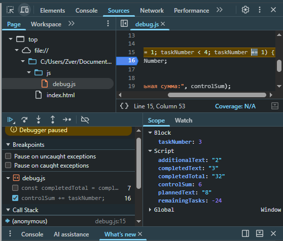

# Практическая работа № 1

**Дисциплина:** Технологии индустриального программирования
**Автор:** Барахоев Абдуллах
**Группа:** ЭФБО-14-25
**Вариант:** 3 (`totalTasks = 9`, `completedTasks = 9`, `dailyLimit = 3`)

---

## 1. Окружение

- ОС: Windows 11
- Node.js: 24.21.0
- npm: 11.19.0
- Git: 2.53.0
- Браузер: Chrome 130

Проверка команд:

```bash
node --version
npm --version
git --version
```

Все три команды выводят номера версий.

---

## 2. Запуск

Все команды выполняются из корня репозитория `tip-js-practices`:

```bash
node practice-01/js/hello.js
node practice-01/js/types.js
node practice-01/js/progress.js
node practice-01/js/plan.js
node practice-01/js/debug.js
```

В браузере: открыть `practice-01/index.html`, в теге `<script>` заменить путь на нужный файл (например, `./js/progress.js`), сохранить, перезагрузить страницу и открыть Console в DevTools (F12).

---

## 3. Задание 1. Две среды выполнения

Файл `hello.js` запущен двумя способами:

1. **Node.js:** `node practice-01/js/hello.js`
2. **Браузер:** через `practice-01/index.html`, вывод — во вкладке Console

Вывод совпадает, кроме последней строки:

| Среда | Значение `typeof document` |
|---|---|
| Node.js | `undefined` |
| Браузер | `object` |

**Объяснение.** `document` — объект DOM, который предоставляет браузер для работы с HTML-страницей. Node.js не создаёт HTML-страницу и не имеет DOM, поэтому `document` в нём не определён. Один и тот же файл работает в обеих средах, но браузерные объекты доступны только в браузере.

---

## 4. Задание 2. Типы и преобразования

| № | Выражение | Ожидание | Факт | Тип | Объяснение |
|---|---|---|---|---|---|
| 1 | `"8" + 2` | `"82"` | `"82"` | `string` | `+` со строкой выполняет конкатенацию |
| 2 | `"8" - 2` | `6` | `6` | `number` | `-` приводит операнды к числу |
| 3 | `Number("8") + 2` | `10` | `10` | `number` | Явное преобразование строки в число |
| 4 | `"12" > "3"` | `false` | `false` | `boolean` | Строки сравниваются посимвольно: `"1" < "3"` |
| 5 | `12 === "12"` | `false` | `false` | `boolean` | `===` не приводит типы, number ≠ string |
| 6 | `Number("")` | `0` | `0` | `number` | Пустая строка преобразуется в `0` |
| 7 | `Number("text")` | `NaN` | `NaN` | `number` | Непреобразуемая строка даёт `NaN`, но тип остаётся `number` |
| 8 | `Boolean("false")` | `true` | `true` | `boolean` | Непустая строка всегда истинна |
| 9 | `typeof null` | `"object"` | `"object"` | `string` | Историческая особенность JavaScript |
| 10 | `typeof NaN` | `"number"` | `"number"` | `string` | `NaN` — числовое значение, означающее «не число» |

Проверено в Node.js и в браузере. Вывод совпадает.

---

## 5. Задание 3. Сводка выполнения задач

**Вариант:** 3

**Входные данные:** `totalTasks = 9`, `completedTasks = 9`

**Вывод для своего варианта:**

```
Всего задач: 9
Выполнено: 9
Осталось: 0
Прогресс: 100.0%
Статус: Завершено
```

**Таблица проверок:**

| № | totalTasks | completedTasks | Ожидание | Факт | Итог |
|---|---|---|---|---|---|
| 1 | 9 | 9 | 100.0%, «Завершено» | 100.0%, «Завершено» | Пройдено |
| 2 | 12 | 5 | 41.7%, «В работе» | 41.7%, «В работе» | Пройдено |
| 3 | 0 | 0 | «Задач пока нет» | «Задач пока нет» | Пройдено |
| 4 | 5 | 0 | 0.0%, «Не начато» | 0.0%, «Не начато» | Пройдено |
| 5 | 5 | 5 | 100.0%, «Завершено» | 100.0%, «Завершено» | Пройдено |
| 6 | 5 | 6 | Ошибка | Ошибка | Пройдено |
| 7 | -1 | 0 | Ошибка | Ошибка | Пройдено |
| 8 | 5 | 2.5 | Ошибка | Ошибка | Пройдено |
| 9 | "5" | 2 | Ошибка | Ошибка | Пройдено |
| 10 | 1001 | 0 | Ошибка | Ошибка | Пройдено |
| 11 | NaN | 0 | Ошибка | Ошибка | Пройдено |

После проверок в файле возвращены значения варианта 3: `9 / 9`.

Проверено в Node.js и в браузере — вывод совпадает.

---

## 6. Задание 4. План выполнения задач по дням

**Вариант:** 3

**Входные данные:** `totalTasks = 9`, `completedTasks = 9`, `dailyLimit = 3`

**Вывод для своего варианта:**

```
Все задачи уже выполнены
Потребуется дней: 0
```

При этом наборе цикл не запускается, так как все задачи уже выполнены. Дополнительно работа цикла показана на общем примере `12 / 5 / 3`:

```
Осталось задач: 7
День 1: выполнено 3, осталось 4
День 2: выполнено 3, осталось 1
День 3: выполнено 1, осталось 0
Потребуется дней: 3
```

**Таблица проверок:**

| № | totalTasks | completedTasks | dailyLimit | Ожидание | Факт | Итог |
|---|---|---|---|---|---|---|
| 1 | 9 | 9 | 3 | 0 дней, цикл не идёт | 0 дней | Пройдено |
| 2 | 12 | 5 | 3 | 3 дня, последний — 1 задача | 3 дня | Пройдено |
| 3 | 10 | 4 | 3 | 2 дня по 3 задачи | 2 дня | Пройдено |
| 4 | 5 | 3 | 10 | 1 день, выполнено 2 | 1 день | Пройдено |
| 5 | 5 | 5 | 2 | 0 дней, цикл не идёт | 0 дней | Пройдено |
| 6 | 0 | 0 | 2 | 0 дней, цикл не идёт | 0 дней | Пройдено |
| 7 | 5 | 2 | 0 | Ошибка | Ошибка | Пройдено |
| 8 | 5 | 2 | 1.5 | Ошибка | Ошибка | Пройдено |
| 9 | 5 | 6 | 2 | Ошибка | Ошибка | Пройдено |
| 10 | 5 | 2 | "2" | Ошибка | Ошибка | Пройдено |
| 11 | 5 | 2 | 1001 | Ошибка | Ошибка | Пройдено |

После проверок в файле возвращены значения варианта 3: `9 / 9 / 3`.

Проверено в Node.js и в браузере — вывод совпадает.

---

## 7. Задание 5. Поиск логических ошибок через DevTools

**Исходный вывод (с ошибками):**

```
Выполнено: 32
Осталось: -24
Контрольная сумма: 6
```

Исключения не было — программа выполнилась, но результат неверный.

**Наблюдения через точки останова:**

1. Breakpoint на строке `const completedTotal = ...`. В панели Scope видно, что `completedText = "3"` и `additionalText = "2"` — обе переменные являются строками.
2. После шага Step over значение `completedTotal = "32"` — строки склеились, а не сложились.
3. Breakpoint внутри цикла: `taskNumber` принимает значения 1, 2, 3 и останавливается. Условие `taskNumber < 4` не даёт дойти до 4.

Скриншот: 

**Таблица ошибок:**

| Ошибка | Что наблюдалось | Причина | Исправление | Результат |
|---|---|---|---|---|
| Обработка количества задач | `32` и `-24` | Оператор `+` со строками выполняет конкатенацию | `Number(completedText) + Number(additionalText)` | `5` и `3` |
| Граница цикла | Сумма `6` вместо `10` | Условие `taskNumber < 4` исключает число 4 | `taskNumber <= 4` | Сумма `10` |

**Вывод после исправления:**

```
Выполнено: 5
Осталось: 3
Контрольная сумма: 10
```

Проверено в Node.js и в браузере — вывод совпадает.

---

## 8. Вывод

В ходе работы освоены:

- запуск JavaScript в двух средах — Node.js и браузере — и понимание различий между ними;
- типы данных, явное преобразование, строгое сравнение;
- условия и проверка входных данных с отсечением некорректных значений;
- цикл `while` с корректной обработкой последней итерации;
- отладка через точки останова в Chrome DevTools;
- базовый цикл работы с Git: `status`, `add`, `commit`, `push`.

Наиболее показательной оказалась ошибка в `debug.js`: без явного преобразования строк оператор `+` выполняет конкатенацию, и сумма молча даёт неверный результат без исключения. Это подтверждает, что отсутствие ошибки в консоли ещё не означает правильность вычислений, а точка останова помогает увидеть типы значений до того, как программа продолжит работу.