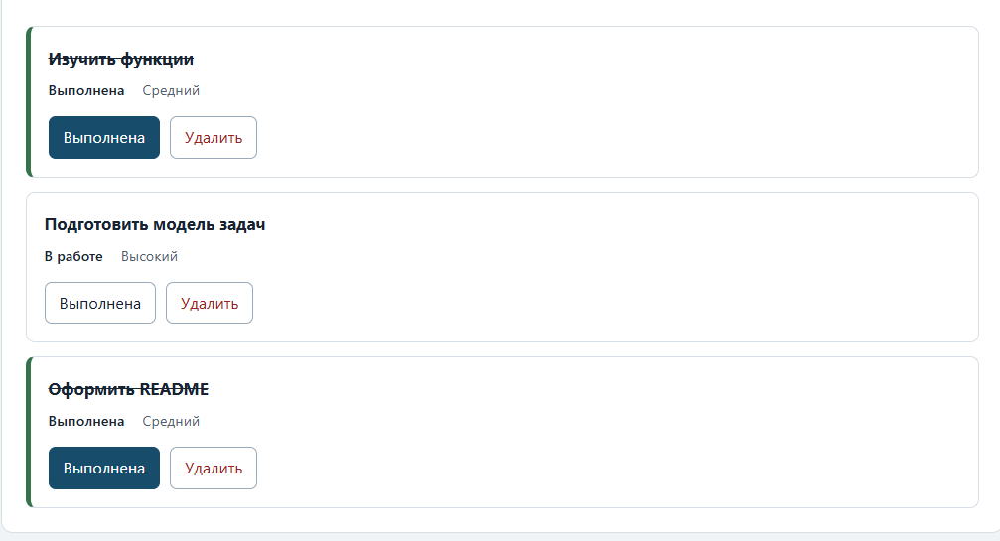
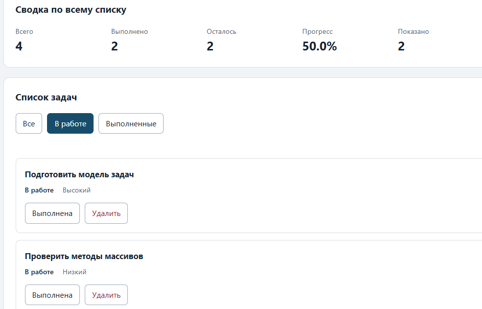
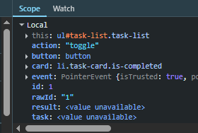

# Практическая работа № 3. Работа с DOM и событиями

## Данные работы

| Поле | Значение |
|---|---|
| Имя | Барахоев Абдуллах |
| Группа | ЭФБО-14-25 |
| Вариант из ПР2 | 3 |
| Node.js | v24.21.0 |
| Браузер | Chrome 130 |
| Операционная система | Windows 11 |

## Запуск

Рабочая папка: `practice-03` внутри личного репозитория.

```bash
npm run check:service
npm start
```

Устанавливать зависимости через `npm install` не требуется. Для PowerShell при блокировке `npm.ps1` доступны `npm.cmd` и прямые команды `node`.

```text
http://127.0.0.1:5503/
http://127.0.0.1:5503/index.html?dataset=variant
http://127.0.0.1:5503/examples/dom-events.html
http://127.0.0.1:5503/checks.html
```

Остановка сервера: `Ctrl+C`.

## Что перенесено из ПР2

Файлы `src/task-service.js` и `src/data.js` скопированы из папки `practice-02/src/` без изменений: девять прикладных функций (`createTask`, `findTaskById`, `getPendingTasks`, `getTaskTitles`, `getTaskStats`, `addTask`, `setTaskCompleted`, `renameTask`, `removeTask`) и данные (`demoTasks`, `variantNumber = 3`, `variantTasks` из шести задач с идентификаторами `[11, 23, 37, 41, 58, 64]`).

Повторная проверка через `npm run check:service` (или `node practice-03/checks/service.checks.js`) дала результат:

```text
Проверок пройдено: 35; не пройдено: 0.
```

Исправления при переносе не потребовались.

## Эксперименты

| № | До запуска: прогноз | После запуска: результат | Объяснение |
|---:|---|---|---|
| 1. Отсутствующий элемент и коллекция | `querySelector` для несуществующего селектора вернёт `null`. `querySelectorAll` вернёт не `null`, а пустую коллекцию. | `Отсутствующий элемент: null`, `Пустая коллекция: 0` | `querySelector` возвращает первый найденный элемент или `null`. `querySelectorAll` всегда возвращает `NodeList`, даже пустой — поэтому `.length` равен `0`, а не ошибка. Обращение к свойству у `null` вызвало бы исключение, у пустого `NodeList` — нет. |
| 2. dataset и числовой id | Ожидал, что `dataset.taskId` вернёт число `23`. | `dataset.taskId: 23 string`, `Числовой id: 23` | Прогноз оказался неверным: `dataset` **всегда** возвращает строки. Значение `"23"` — это `string`, а не `number`. Перед использованием как число его нужно преобразовать через `Number()` и проверить `Number.isSafeInteger`. |
| 3. Статический NodeList | Думал, что сохранённая коллекция обновится после добавления новой записи. | `Исходная длина NodeList: 1`, `Старый NodeList: 1`, `Новый querySelectorAll: 2` | Прогноз не подтвердился: `NodeList` из `querySelectorAll` **статический** — добавление элементов в DOM не увеличивает ранее сохранённую переменную. Для актуального снимка нужен новый вызов `querySelectorAll`. |
| 4. Строка с HTML-разметкой | Предполагал, что `<strong>` внутри строки станет жирным тегом на странице. | В заголовке появилась буквальная строка `<strong>Это текст, а не HTML</strong>`, жирный `<strong>` не создался | `textContent` вставляет значение как **текст**, не интерпретируя HTML. Угловые скобки видны как символы, тег не создаётся. Это защищает от XSS при выводе пользовательских данных. |
| 5. Распространение события | Ожидал, что сначала сработает обработчик на элементе, где кликнули, а потом на родителе. | В Console: `phase=1` (capture) → `phase=3` (bubble). В Scope: `event.target` = `<button id="lab-button">`, `event.currentTarget` = `<section id="lab-card">` | Порядок оказался правильным: сначала **захват** (фаза 1), затем **всплытие** (фаза 3). `event.target` — где реально кликнули (кнопка), `event.currentTarget` — где висит обработчик (карточка). Обработчик на карточке поймал клик по вложенной кнопке — на этом основано делегирование событий. |

## Задание 2. Карточка задачи и отрисовка списка

Реализованы две функции в `src/task-view.js`: `createTaskElement(task)` и `renderTaskList(listElement, tasks)`.

**`createTaskElement`** создаёт DOM-элемент `li.task-card` с содержимым:

- `data-task-id` — идентификатор задачи (строка);
- класс `is-completed` — добавляется для выполненной задачи;
- `h3.task-title` — название через `textContent`;
- `span.task-status` — «Выполнена» или «В работе»;
- `span.task-priority` — «Низкий», «Средний» или «Высокий»;
- `div.task-actions` с двумя кнопками:
  - `button[data-action="toggle"][aria-pressed]` со вложенным `span.action-label` «Выполнена»;
  - `button[data-action="delete"]` со вложенным `span.action-label` «Удалить».

**`renderTaskList`** использует `replaceChildren(...cards)` — сам контейнер `ul#task-list` сохраняется, заменяются только дочерние элементы.

### Проверки

| Проверка | Ожидание | Фактический результат | Итог |
|---|---|---|---|
| Главная страница без параметров | 4 карточки из `demoTasks` | 4 карточки | Пройдено |
| `?dataset=variant` | 6 карточек из `variantTasks` | 6 карточек | Пройдено |
| Название `<strong>Это текст, а не HTML</strong>` | Отображается как буквальная строка, не как HTML | Отображается как текст, жирный `<strong>` не создан | Пройдено |
| Повторный рендер (F5 несколько раз) | Количество карточек не растёт | Стабильно 4 (общий) / 6 (вариант) | Пройдено |

Название задачи выводится через `textContent`, а не через `innerHTML`. Это защищает от XSS.

Скриншот списка: 

## Задание 3. Делегирование, изменение статуса и удаление

В `main.js` реализован `handleTaskListClick(event)`. Подписка на `#task-list` выполняется один раз через `addEventListener` — обработчик не пересоздаётся при перерисовке.

**Порядок обработки:**

1. Проверка, что `event.target` — элемент (`instanceof Element`).
2. Поиск кнопки через `event.target.closest("button[data-action]")`.
3. Проверка, что кнопка принадлежит `#task-list` (`elements.list.contains`).
4. Распознавание действия: `toggle` или `delete`.
5. Поиск карточки `li[data-task-id]`, чтение `dataset.taskId`.
6. Преобразование в число: `Number(rawId)`, проверка `Number.isSafeInteger(id) && id > 0`.
7. Поиск задачи через `findTaskById(currentTasks, id)`.
8. Вызов `setTaskCompleted(currentTasks, id, !task.completed)` или `removeTask(currentTasks, id)`.
9. При успехе: `currentTasks = result.tasks`, очистка сообщения, `renderApp()`, `restoreTaskFocus(id, action)`.
10. При отказе: сообщение в `#operation-message`, состояние не меняется.

**Проверки:**

| Действие | Ожидание | Фактический результат | Итог |
|---|---|---|---|
| Клик «Выполнена» на `id = 4` | Статус меняется на «Выполнена» | Изменился | Пройдено |
| Повторный клик «Выполнена» на `id = 4` | Возврат в «В работе» | Вернулся | Пройдено |
| Клик «Удалить» на `id = 7` | Карточка исчезает, остаются `[1, 4, 10]` | Исчезла | Пройдено |
| Клик по вложенному `<span>` внутри кнопки | Действие срабатывает | Работает | Пройдено |
| Клик по названию задачи | Ничего не происходит | Ничего | Пройдено |
| Клик вне карточки | Ничего не происходит | Ничего | Пройдено |
| Временная замена `data-task-id` на `"777"` | Сообщение «задача не найдена», данные не меняются | Сообщение выведено | Пройдено |
| Временная замена `data-task-id` на `"4abc"` | Сообщение «некорректный id», данные не меняются | Сообщение выведено | Пройдено |

Скриншот: 

## Задание 4. Фильтры, сводка и пустые состояния

Реализованы три функции и один обработчик:

- `getVisibleTasks(tasks, filter)` в `src/task-selectors.js` — отбирает задачи по фильтру, возвращает **новый** массив.
- `renderSummary(summaryElement, tasks, visibleCount)` в `src/task-view.js` — обновляет пять `[data-stat]` внутри `#task-summary`.
- `renderEmptyState(messageElement, total, visibleCount)` в `src/task-view.js` — различает пустой список и отсутствие совпадений.
- `handleFilterClick(event)` в `src/main.js` — распознаёт фильтр через `closest` и вызывает `renderApp`.

**`renderApp`** — центральная функция обновления: вычисляет `visibleTasks = getVisibleTasks(currentTasks, currentFilter)` и синхронно обновляет список, сводку, пустое состояние и активную кнопку фильтра. Состояние `currentTasks` не меняется при смене фильтра.

**Ключевое различие:** сводка считается по `currentTasks` (полный массив), а количество показанных — по `visibleTasks.length` (выборка). Поэтому при переключении фильтра общий прогресс остаётся неизменным.

**Проверки:**

| Проверка | Ожидание | Фактический результат | Итог |
|---|---|---|---|
| Фильтр «Все» | 4 карточки `[1, 4, 7, 10]` | 4 карточки | Пройдено |
| Фильтр «В работе» | 2 карточки `[4, 7]` | 2 карточки | Пройдено |
| Фильтр «Выполненные» | 2 карточки `[1, 10]` | 2 карточки | Пройдено |
| Сводка при смене фильтра | Всего/Выполнено/Осталось/Прогресс не меняются | Не меняются: 4 / 2 / 2 / 50.0% | Пройдено |
| «Показано» при смене фильтра | Меняется: 4 → 2 → 2 | Меняется | Пройдено |
| Активная кнопка фильтра | `is-active` и `aria-pressed="true"` на выбранной | Устанавливается | Пройдено |
| Пустой результат фильтра | «Нет задач по выбранному фильтру.», `hidden = false` | Отображается | Пройдено |
| Полностью пустой список | «Список задач пуст.», сводка `0 / 0 / 0 / 0.0% / 0` | Отображается | Пройдено |
| Состояние фильтра после действия | Фильтр сохраняется, карточки перерисовываются | Сохраняется | Пройдено |

Скриншот фильтра «В работе»: 

## Организация кода

Приложение разделено на модули по ответственности:

- `src/data.js` — общий набор `demoTasks` и данные варианта `variantTasks`, номер варианта `variantNumber`. Работа с DOM здесь отсутствует.
- `src/task-service.js` — девять прикладных функций из ПР2. Не содержит обращений к DOM.
- `src/task-selectors.js` — `getVisibleTasks(tasks, filter)`: вычисляет выборку по текущему фильтру, возвращает новый массив.
- `src/task-view.js` — `createTaskElement`, `renderTaskList`, `renderSummary`, `renderEmptyState`: создание и обновление DOM. Обработчики здесь не назначаются.
- `src/main.js` — состояние (`currentTasks`, `currentFilter`), обработчики (`handleTaskListClick`, `handleFilterClick`), центральная функция `renderApp`. Подписки на события выполняются один раз.

**Где что хранится:**
- Полный список задач — `currentTasks` в `main.js`.
- Текущий фильтр — `currentFilter` в `main.js`.
- Обработка событий — `handleTaskListClick` и `handleFilterClick` в `main.js`.
- Расчёт сводки — `getTaskStats` в `task-service.js`, отображение — `renderSummary` в `task-view.js`.

## Общий сценарий

| Шаг | Видимые id | Всего | Выполнено | Осталось | Прогресс | Показано | Сообщение | Совпало с ожиданием |
|---:|---|---|---|---|---|---|---|---|
| 0 | [1, 4, 7, 10] | 4 | 2 | 2 | 50.0% | 4 | — | Да |
| 1 | [4, 7] | 4 | 2 | 2 | 50.0% | 2 | — | Да |
| 2 | [7] | 4 | 3 | 1 | 75.0% | 1 | — | Да |
| 3 | [1, 4, 7, 10] | 4 | 3 | 1 | 75.0% | 4 | — | Да |
| 4 | [1, 4, 10] | 3 | 3 | 0 | 100.0% | 3 | — | Да |
| 5 | [] | 3 | 3 | 0 | 100.0% | 0 | Нет задач по выбранному фильтру. | Да |
| 6 | [1, 4, 10] | 3 | 2 | 1 | 66.7% | 3 | — | Да |
| 7 | [] | 0 | 0 | 0 | 0.0% | 0 | Список задач пуст. | Да |

После F5 данные возвращаются к шагу 0 — сохранение между перезагрузками в ПР3 не предусмотрено.

## Индивидуальный вариант

Вариант 3 — тема «Создание сайта-портфолио». Шесть задач: `[11, 23, 37, 41, 58, 64]`. Первые две (`11`, `23`) выполнены изначально.

| Этап | Всего | Выполнено | Осталось | Прогресс | Видимые id |
|---|---|---|---|---|---|
| До действий (фильтр «Все») | 6 | 2 | 4 | 33.3% | [11, 23, 37, 41, 58, 64] |
| После переключения 23 | 6 | 1 | 5 | 16.7% | [11, 23, 37, 41, 58, 64] |
| После удаления 37 | 5 | 1 | 4 | 20.0% | [11, 23, 41, 58, 64] |
| Итог, фильтр «В работе» | 5 | 1 | 4 | 20.0% | [23, 41, 58, 64] |
| Итог, фильтр «Выполненные» | 5 | 1 | 4 | 20.0% | [11] |

Кнопка «Выполнена» работает как переключатель: задача `id = 23` была выполнена (`true`), после клика стала невыполненной (`false`). Прогресс упал с 33.3% до 16.7%. Это соответствует таблице методички для варианта 3: «Выполнено после двух действий = 1, итоговый прогресс = 20.0%» (после удаления `id = 37`).

## Протокол проверки сервиса

```text
Проверок пройдено: 35; не пройдено: 0.
```

## Протокол браузерных проверок

```text
Всего: 36. Пройдено: 36. Ошибок: 0.
```

## Собственные проверки

| № | Исходное состояние и действия | Ожидаемый результат | Фактический результат | Итог |
|---:|---|---|---|---|
| 1 | Открыть общий набор, удалить 3 задачи из 4 (остаётся `id = 1`). Отметить её выполненной, затем удалить | Список пуст, сообщение «Список задач пуст.», сводка `0 / 0 / 0 / 0.0% / 0` | Совпало | Пройдено |
| 2 | Открыть общий набор, 5 раз подряд нажать «Выполнена» на карточке `id = 4` | Статус переключается 5 раз (`false → true → false → true → false`); количество карточек не растёт; `ul#task-list` не заменяется | Совпало | Пройдено |
| 3 | Открыть общий набор, кликнуть точно по `<span class="action-label">` внутри кнопки «Выполнена» | Действие срабатывает через `closest`, `event.target` — `<span>` | Совпало | Пройдено |

**Пояснение:**
- Сценарий 1 — граничное состояние: единственная задача → полностью пустой список.
- Сценарий 2 — повторная отрисовка: `replaceChildren` не накапливает карточки, контейнер `#task-list` сохраняется (обработчик не пересоздаётся).
- Сценарий 3 — событие через вложенный элемент: делегирование работает не только при клике по краю кнопки, но и по тексту внутри.

## Отладка и клавиатура

**Точка останова** в `handleTaskListClick` в `src/main.js` на строке 51 (`const action = button.dataset.action;`). После клика по кнопке карточки и пошагового прохода через F10 в панели Scope зафиксировано:

- `event.target` — `<button data-action="toggle">` (клик пришёлся на край кнопки);
- `button` (после `event.target.closest("button[data-action]")`) — та же кнопка с `data-action="toggle"`;
- `action` — строка `"toggle"`;
- `card` — `li.task-card` (найдена через `closest("li[data-task-id]")`);
- `rawId` — строка `"1"` (`dataset.taskId` всегда строка);
- `id` — число `1` (после `Number(rawId)` и проверки `Number.isSafeInteger`);
- `task` — объект задачи `id = 1` «Изучить функции», `completed: true` (найден через `findTaskById`);
- `result` — `{ ok: true, tasks: [...] }` (успешный результат `setTaskCompleted`).

Клик по краю кнопки и клик по вложенному `<span>` дают одинаковый результат: `closest("button[data-action]")` находит одну и ту же кнопку — либо саму кнопку, либо её предка от `<span>`. На этом и основано делегирование событий.

**Клавиатура.** Кнопки — реальные `button type="button"`, доступны через `Tab`. Активация через **Enter** и **Space** работает. После изменения статуса фокус сохраняется на той же кнопке той же задачи благодаря `restoreTaskFocus(id, action)`. При удалении карточки фокус переходит на активный фильтр.

**Отказ.** При временной замене `data-task-id` карточки на `"777"` в DevTools → Elements и клике появляется сообщение «Ошибка: задача с id 777 не найдена». При замене на `"4abc"` — «Ошибка: некорректный id задачи "4abc"». Данные не изменяются ни в том, ни в другом случае.

Скриншот: 

## Вид приложения


## Дополнительное задание

Не выполнялось.

## Вывод

В ходе работы связаны данные и прикладные функции ПР2 с браузерным интерфейсом:

- Освоены DOM-методы: `querySelector`, `querySelectorAll`, `createElement`, `textContent`, `append`, `replaceChildren`, `classList`, `dataset`, `hidden`.
- Реализовано делегирование событий: один обработчик на `#task-list` ловит клики по вложенным кнопкам через `closest`. Подписка выполняется один раз при старте.
- Разграничены `event.target` (где реально кликнули) и `event.currentTarget` (где висит обработчик).
- Реализована полная перерисовка представления после каждого изменения состояния через `renderApp`.
- Фильтры не изменяют `currentTasks` — только вычисляют `visibleTasks`. Сводка всегда считается по полному массиву.
- Различаются два пустых состояния: полностью пустой список и отсутствие совпадений по фильтру.
- Названия и сообщения выводятся через `textContent`, а не `innerHTML`. Это защищает от XSS.

**Главное различие — изменение данных и изменение DOM.** Простое удаление DOM-узла `<li>` не удаляет задачу из приложения: после следующей перерисовки карточка вернётся. Удаление возможно только через `removeTask`, которая возвращает **новый** массив; он присваивается в `currentTasks`, и только после этого `renderApp` перерисовывает список.

Наиболее показательным было задание 5 (отладка через точку останова): удалось проследить путь одного клика — от `event.target` до `result.tasks`. Это подтвердило, что интерфейс не содержит собственной логики изменения данных, а только вызывает функции ПР2 и обновляет представление.